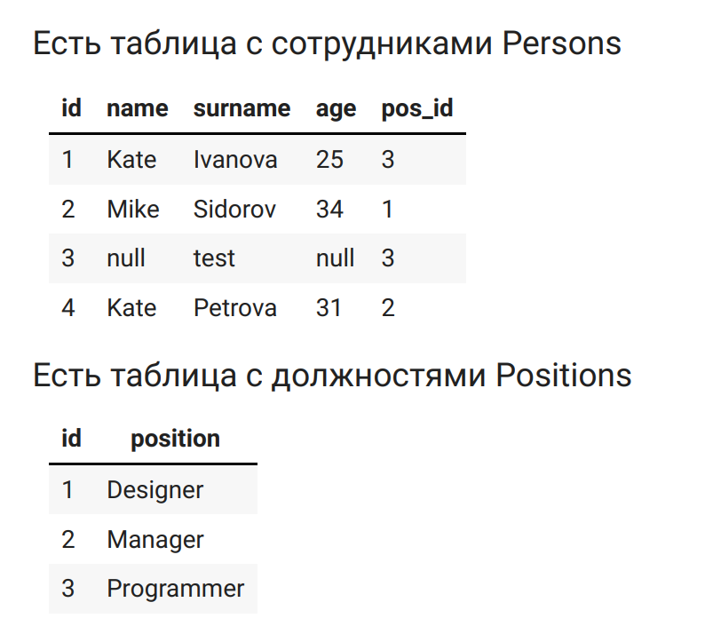

## Тестовое задание для тестописателя Python и SQL тренажёров

Общее описание

Цель данного тестового задания - оценить навыки работы с Python и SQL, а также умение писать тесты и работать с технологиями автоматизации тестирования. Задание включает в себя разработку нескольких скриптов и написание SQL запросов.


<details>
  <summary>
Задача 1: Сумма диагоналей матрицы

(нажмите, чтобы раскрыть описание)
</summary>

- Скрипт содержит метод `diagonals_sum`, который принимает на вход матрицу и возвращает сумму её диагоналей.
- Запуск: `python task_1.py`
- **Задача**: 

Написать метод diagonals_sum который принимает на вход матрицу размерностью NxN и
возвращает число, равное сумме диагоналей. Тип входной матрицы может варьироваться: list ,
numpy.array , pandas.dataframe . На выходе должно быть число типа int или float . Решение
сохраните в скрипт task_1.py

**Пример 1:**

**Вход:**
```
[[1, 2, 3],
[4, 5, 6],
[7, 8, 9]]
```

**Выход:**

```30```


**Пример 2:**

**Вход:**

```
np.array([[1, 2, 3, 4],
[5, 6., 7., 8],
[9, 10., 11., 12],
[13, 14, 15, 16]])
```

**Выход:**

```68.```
</details>

[Решение задачи 1](https://github.com/dazdik/Test_for_YA/blob/master/task_1.py)

<details>
  <summary>
Задача 2: Декоратор времени выполнения

(нажмите, чтобы раскрыть описание)
</summary>

- Файл: `task_2.py`
- Пример использования параметризованного декоратора для измерения времени выполнения функции.
- Запуск: `python task_2.py`
- **Задача**: 

Напишите параметризованный декоратор, который принимает на вход единицу измерения
(секунда или миллисекунда), и печатает время выполнения декорированной функции.
Продемонстрируйте пример использования декоратора на функции из **Задания 1**. 

</details>

[Решение задачи 2](https://github.com/dazdik/Test_for_YA/blob/master/task_2.py)

<details>
  <summary>
Задача 3: Проверка наличия функции в файле

(нажмите, чтобы раскрыть описание)
</summary>

- Файл: `task_3.py`
- Описание: Метод для проверки наличия объявления функции `diagonals_sum` в файле, используя `ast`.
- Запуск: `python task_3.py`

- **Задача**: 

Напишите метод на вход которого вводится название файла, а на выходе булевое значение есть ли
в файле объявление функции `diagonals_sum` с аргументом `matrix` ( `True` - если есть, `False` - если
нет).

Для решения этой задачи воспользуйтесь библиотекой ast. 
https://docs.python.org/3/library/ast.html

</details>

[Решение задачи 3](https://github.com/dazdik/Test_for_YA/blob/master/task_3.py)

<details>
  <summary>
Задача 4: SQL запросы

(нажмите, чтобы раскрыть описание)
</summary>

- Файл: `queries_for_4task.py`
- Описание: Набор SQL запросов для работы с данными сотрудников и должностей.

- **Задача**: 



* Напишите запрос, чтобы получить таблицу с полями name, position. Приложите ожидаемый
результат запроса
* Напишите запрос, чтобы получить средний возраст сотрудников компании. Приложите ожидаемый
результат запроса.
* Напишите запрос чтобы получить количество уникальных имен сотрудников. Приложите
ожидаемый результат запроса.


</details>

[Решение задачи 4](https://github.com/dazdik/Test_for_YA/blob/master/queries_for_4task.py)


<details>
  <summary>
Задача 5: Тестирование классификатора

(нажмите, чтобы раскрыть описание)
</summary>

- Файл: `task_5.py`
- Описание: Тест для проверки классификатора дерева решений, который должен выполниться за менее чем 10 секунд.
- Запуск: `python task_5.py`

- **Задача**: 

Напишите тест к реальной задаче, используя основные инструменты unit тестирования на python.
Обратите внимание, что выполнение эталонного решения занимает более 60 секунд. Исполнение
теста должно занимать не более 10 секунд. Свое решение сохраните в task_5.py

_Формулировка задачи:_

Разделите выборку на на тестовую и тринировочную. Обучите классификатор на основе алгоритма
Дерева решений, используйте критерий poisson для создания модели. Используйте параметр
random_state=0 для проверки вашего решения

_Начальный код, который студент должен заполнить чтобы решить задачу_
```python
from sklearn.tree import DecisionTreeRegressor
from sklearn.model_selection import train_test_split
import numpy as np
n_samples, n_features = 1000000, 20
X = rng.randn(n_samples, n_features)
y = rng.poisson(lam=np.exp(X[:, 5]) / 2)
X_train, X_test, y_train, y_test = # ваш код здесь
regressor = # ваш код здесь
```
_Эталонное решение_

```python
from sklearn.tree import DecisionTreeRegressor
from sklearn.model_selection import train_test_split
import numpy as np
n_samples, n_features = 1000000, 20
X = rng.randn(n_samples, n_features)
y = rng.poisson(lam=np.exp(X[:, 5]) / 2)
X_train, X_test, y_train, y_test = train_test_split(X, y, random_state=0)
regressor = DecisionTreeRegressor(criterion="poisson", random_state=0)
regressor.fit(X_train, y_train)
```

</details>

[Решение задачи 5](https://github.com/dazdik/Test_for_YA/blob/master/task_5.py)

<details>
  <summary>
Задача 6: Проверка Dockerfile

(нажмите, чтобы раскрыть описание)
</summary>

- Файл: `Dockerfile`


- **Задача**: 

В рамках курса вам необходимо чтобы в пространстве студента были доступны основные
интструменты библиотеки `scikit-learn`. 
Ваши коллеги авторы предоставили вам примеры кода,
которые должны работать в пространстве студента.

_Пример кода 1_


```python
import pandas as pd

data = pd.DataFrame({'col1': [1,np.nan,2], 'col2': [3,4,5]})

from sklearn.impute import SimpleImputer
si = SimpleImputer()
pd.DataFrame(si.fit_transform(data),
columns = si.get_feature_names_out())
```
_Пример кода 2_

```python
from sklearn.datasets import make_classification
from sklearn.linear_model import LogisticRegression
from sklearn.model_selection import ValidationCurveDisplay


X, y = make_classification(1000, 10, random_state=0)
_ = ValidationCurveDisplay.from_estimator(
LogisticRegression(),
X,
y,
param_name="C",
param_range=np.geomspace(1e-5, 1e3, num=9),
score_type="both",
score_name="Accuracy",
)
```
_Пример кода 3_
```python
import numpy as np
from sklearn.cluster import HDBSCAN
from sklearn.datasets import load_digits
from sklearn.metrics import v_measure_score


X, true_labels = load_digits(return_X_y=True)
print(f"number of digits: {len(np.unique(true_labels))}")
hdbscan = HDBSCAN(min_cluster_size=15).fit(X)
non_noisy_labels = hdbscan.labels_[hdbscan.labels_ != -1]
print(f"number of clusters found: {len(np.unique(non_noisy_labels))}")
print(v_measure_score(true_labels[hdbscan.labels_ != -1], non_noisy_labels))
```

**Докер образ**

Есть докер, который в качестве базового образа использует `python:3.9.9-slim` . Ваш коллега
составил докерфайл для этого образа:

```dockerfile
FROM python:3.9.9-slim
COPY requirements.txt .
RUN python -m pip install --upgrade pip \
&& pip install --no-cache-dir -r requirements.txt

```
где файл для requirements.txt:

```
pandas=2.0.3
numpy=1.17.2
scikit-learn=1.3.2
scipy=1.3.2
joblib=1.1.1

```
Попробуйте собрать докер и проверить, работает ли на нем необходимый функционал scikitlearn . Подробно опишите шаги, которые вы прошли для сборки и проверки докера. Удалось ли
собрать его? Если не удалось, то что необходимо исправить в файлах dockerfile и
requirements.txt?

Исправленный файл requirements.txt для запуска и сборки докера:

```
pandas>=1.2
numpy>=1.19.5
scikit-learn>=0.24
scipy>=1.5.4
joblib>=1.0.0
matplotlib==3.8.3
```


</details>


